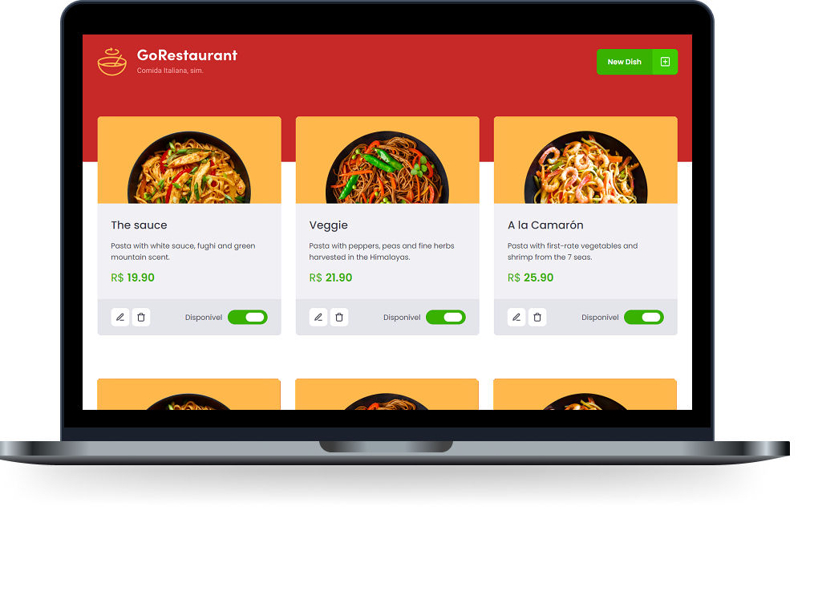

<h1 align="center">
    
</h1>

  <a href="#rocket-tecnologias">Technologies</a>&nbsp;&nbsp;&nbsp;|&nbsp;&nbsp;&nbsp;
  <a href="#-projeto">Project</a>&nbsp;&nbsp;&nbsp;|&nbsp;&nbsp;&nbsp;
  <a href="#-layout">Starting Dev Environment</a>&nbsp;&nbsp;&nbsp;|&nbsp;&nbsp;&nbsp;
  <a href="#memo-licença">License</a>

 

  

 

  

## 🚀 Technologies

This project was developed with the following technologies:

- [Node.js](https://nodejs.org/en/)
- [React](https://reactjs.org)
- [TypeScript](https://www.typescriptlang.org/)

## 💻 Project

Go Restaurant is an application that will connect to a fake API, using React.js together with TypeScript. Practicing the concept of CRUD (Create, Read, Update, Delete). Displaying created food dishes and allowing their creation, removal and updates.

## 🔖 Starting Dev Environment

1. Run `npm install` or `yarn install`. 
2. On a second terminal, start the server `yarn json-server server.json -p 3333`. 
3. Run `yarn start` and access `http://localhost:3000`. 

## :memo: License

This project is under the MIT license. See the [LICENSE] file (LICENSE.md) for more details.

---

Project developed in Rocketseat's GoStack bootcamp ♥
